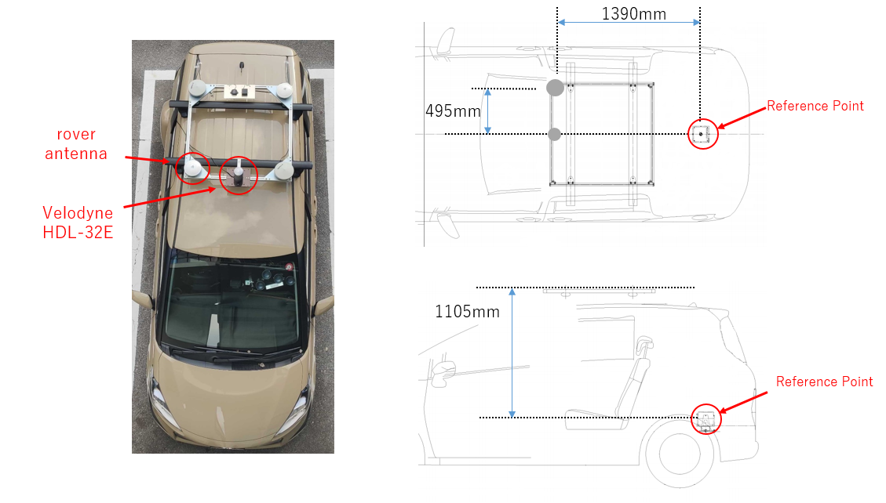
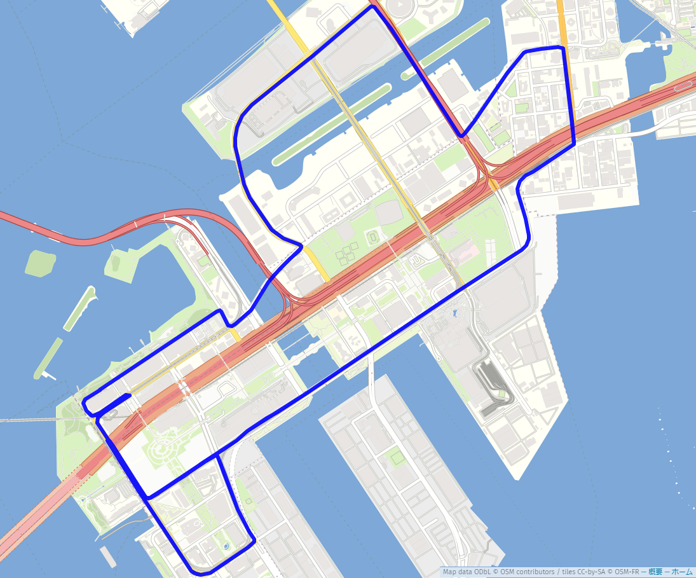
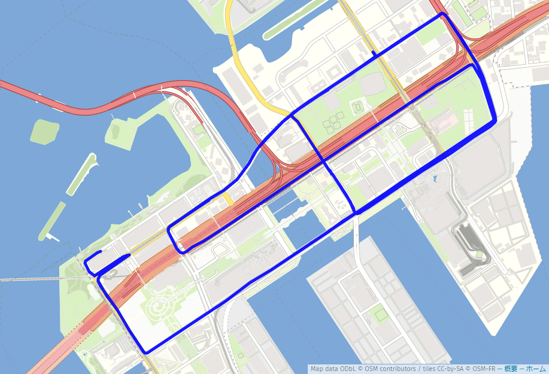
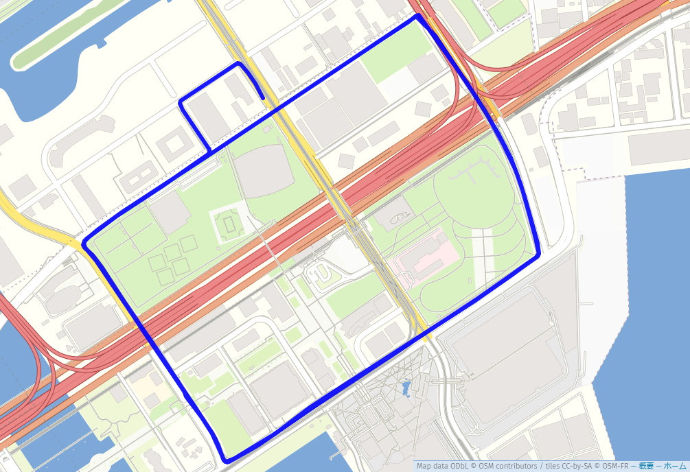

# GNSS/IMU Open Data Set for Autonomous Driving
 If you would like to use the data set, please fill out [this form](https://forms.gle/w22wkHnyewGXhJN6A).
 A representative will contact you with the distribution address.
## System Description

&emsp;This data was collected in the Odaiba area of Tokyo/Japan. 
&emsp;The data includes information on the following sensors. 

- <b>3D LiDAR</b>
  - Model: Velodyne HDL-32E
  - Vertical Field of view (FOV): +10~-30 degrees.
  - Horizontal Field of view (FOV): 360 degrees.
  - Ranging: max 80~100 meters.
  - Data rate: 10 Hz.
  - Channels: 32
  - Accuracy: ± 2 cm accuracy
  
- <b>IMU</b>
  - Model: ADIS16475-2
  - Data rate: 50 Hz
  - Gyro bias Repeatability: 0.7 deg/s
  - Gyro In-Run Bias Stability: 2.5 deg/hr

- <b>Multiple GNSS receivers</b>
  - Model: u-blox F9P
    - Data rate: 5 Hz.
    - GNSS: BeiDou, Galileo, GPS / QZSS
    - GNSS Bands: L2OF, L2C, E1B/C, B2I, E5b, L1C/A, L1OF, B1I
    - Oscillator: TCXO
  - Model: Trimble Alloy (Geodetic GNSS receiver)
    - Data rate: 10 Hz.
    - GNSS: BeiDou, Galileo, GLONASS, GPS / QZSS
    - GNSS Bands: L2OF, L2C, L5, E1B/C, B2I, E5b, L1C/A, L1OF, B1I

- <b>Applanix POS LV</b> (high-grade RTK GNSS/INS integrated navigation system)
  - Model: POS LV 220
  - Data rate: 10 Hz.
  - Accuracy (RMS)
    - X, Y position: 0.02 m
    - Z position: 0.05 m
    - Roll and Pitch angle: 0.015 degree
    - True heading: 0.025 degree

## Data Format

- <b>GNSS</b>

  <b>Filename:</b> 
  &emsp;Obserbation files of "ROVER" are "rover_ublox.obs" and "rover_trimble.obs". 
  &emsp;Obserbation file of "BASE" is "base_trimble.obs". 
  &emsp;Position of BaseStation was -3961904.9530, 3348993.7578, 3698211.7553 in the ECEF coordinates. 
  
  <b>RINEX VERSION:</b>&emsp;RINEX 3.02 
  
  <b>Cycle:</b> 
  |  File Nmae  |  Cycle  |
  | ---- | ---- |
  |  rover_trimble.obs  |  10Hz  |
  |  rover_ublox.obs  |  5Hz  |
  |  base_trimble.obs  |  1Hz  |
  
  <b>GNSS Satellites:</b>&emsp;GPS, GLONASS, Galileo, BeiDou, QZSS 
  
  &emsp;&emsp;Carriers, pseudoranges, dopplers, SNRs are includeed. 
  
- <b>IMU</b>

  <b>Filename:</b>&emsp;imu.csv 
  <b>Data Description</b> 
  
  |  Header  |
  | ---- |
  |  GPS TOW(s)  |
  |  GPS Week  |
  |  Angular rate X(rad/s)  |
  |  Angular rate Y(rad/s)  |
  |  Angular rate Z(rad/s)  |
  |  Acceleration X(m/s^2)  |
  |  Acceleration Y(m/s^2)  |
  |  Acceleration Z(m/s^2)  |
  |  Wheel velocity  |

- <b>LiDAR</b>

  <b>Filename:</b>&emsp;lidar.bag 
  <b>Data Description:</b> 
  &emsp;The LiDAR data was collected with the Velodyne_driver. 
  &emsp;Velodyne HDL-32E was used. The data is stored in the velodyne_packets message. 
  
- <b>True Positions and Poses</b>

  <b>Filename:</b>&emsp;reference.csv 
  <b>Data Description:</b> 
  &emsp;The true positions and poses were collected by POSLV220 with POSPAc(Postporcess). 
  
  |  Header  |
  | ---- |
  |  GPS TOW(s)  |
  |  GPS Week  |
  |  Latitude(deg)  |
  |  Longitude(deg)  |
  |  Ellipsoid Height(m)  |
  |  ECEF X(m)  |
  |  ECEF Y(m)  |
  |  ECEF Z(m)  |
  |  Roll(deg)  |
  |  Pitch(deg)  |
  |  Heading(deg)  |
  |  Velocity X (m/s)  |
  |  Velocity Y (m/s)  |
  |  Velocity Z (m/s)  |
  |  Acceleration X (m/s^2)  |
  |  Acceleration Y (m/s^2)  |
  |  Acceleration Z (m/s^2)  |
  |  Angular rate X (rad/s)  |
  |  Angular rate Y (rad/s)  |
  |  Angular rate Z (rad/s)  |

## Dataset Description

### Data No.1
 <b>Date&emsp;2019/11/02</b> 
 
  |    |  GPS Week  |  GPS TOW(s)  |
  | ---- | ---- | ---- |
  |  Start  |  2077  |  545460  |
  |  End  |  2077  |  548370  |
 
 <b>Environment:</b>&emsp;Odaiba/Tokyo Urban environment [[map](https://www.google.co.jp/maps/@35.6275683,139.7754449,14.75z?hl=ja)] 
 
***
### Data No.2 
 <b>Date&emsp;2019/11/02</b> 
 
  |    |  GPS Week  |  GPS TOW(s)  |
  | ---- | ---- | ---- |
  |  Start  |  2077  |  548488  |
  |  End  |  2077  |  551002  |
 
 <b>Environment:</b>&emsp;Odaiba/Tokyo Urban environment [[map](https://www.google.co.jp/maps/@35.6275683,139.7754449,14.75z?hl=ja)] 
 
***
### Data No.3
 <b>Date&emsp;2019/11/02</b> 
 
  |    |  GPS Week  |  GPS TOW(s)  |
  | ---- | ---- | ---- |
  |  Start  |  2077  |  551105  |
  |  End  |  2077  |  552679  |

 <b>Environment:</b>&emsp;Odaiba/Tokyo Urban environment [[map](https://www.google.co.jp/maps/@35.6343741,139.7892038,15.75z?hl=ja)] 
 

## Contributors
<b>Junichi Meguro, Meijo University, Japan</b> 
<b>Taro Suzuki, Chiba Institute of Technology, Japan</b> 
<b>Nobuaki Kubo, Tokyo University of Marine Science &Technology, Japan</b> 
<b>Kashimoto Takahiro, Meijo University, TOKAI-SOFT Co.,ltd., Japan</b> 

## Acknowledgment
<b>This open dataset collection was conducted in the Cabinet Office's “Strategic Innovation Creation Program (SIP) Phase 2 / Autonomous Driving (System and Service Expansion) / Recognition Technology Necessary for Autonomous Driving Technology (Levels 3 and 4).” The project was commissioned by the New Energy and Industrial Technology Development Organization (NEDO).</b> 

## License
<b>Copyright (c) 2020, Meijo University All rights reserved.</b> 
 
<b>The user must indicate the copyright when using the dataset for the intended purpose.</b> 
 
<b>The user may use the dataset under the following conditions</b> 
The dataset may be used for research and development purposes by non-profit organizations (universities, public research institutions, individuals) and for-profit organizations. 
The user may distribute copies of the dataset only within the organization to which they belong, provided that they maintain this license. 
The user may process the data and create products by maintaining this license.  
The user may publish the results of using the dataset by maintaining this license. 
 
<b>Prohibited matters</b> 
The user may not use the dataset for any act that violates the laws and regulations of Japan or the country or region to which the user belongs. 
The user may not copy or modify the dataset for use in a commercial product. 
The user may not copy the dataset and transfer it to anyone other than their own organization. 
In accordance with the catch-all control of Japan, this dataset is not available to those who belong to [the end-user list](https://www.meti.go.jp/english/press/2020/0508_002.html). 
 
<b>Warranty</b> 
The user is responsible for all problems and damages caused by the use of this dataset. 
The copyright holder is not responsible for and will not be involved in any problems or damages caused by the user's use of this dataset. 
If the user violates the license, the copyright holder can stop the use of the dataset and require the destruction of the dataset, its copies, and the work product. 
