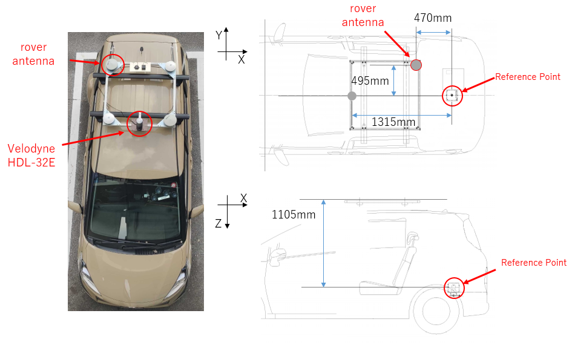

# GNSS/IMU Open Data Set for Autonomous Driving
 If you would like to use the data set, please fill out [this form](https://forms.gle/w22wkHnyewGXhJN6A).
 A representative will contact you with the distribution address. 
 
 <b>This dataset is only available to users in Japan until it is ready to be used overseas. (2021/3/11)</b> 
## System Description

&emsp;This data was collected in the Odaiba area of Tokyo/Japan. 
&emsp;The data includes information on the following sensors. 

- <b>3D LiDAR</b>
  - Model: Velodyne HDL-32E
  - Vertical Field of view (FOV): +10~-30 degrees.
  - Horizontal Field of view (FOV): 360 degrees.
  - Ranging: max 80~100 meters.
  - Data rate: 10 Hz.
  - Channels: 32
  - Accuracy: ± 2 cm accuracy
  
- <b>IMU</b>
  - Model: ADIS16475-2
  - Data rate: 50 Hz
  - Gyro bias Repeatability: 0.7 deg/s
  - Gyro In-Run Bias Stability: 2.5 deg/hr

- <b>Multiple GNSS receivers</b>
  - Model: u-blox F9P
    - Data rate: 5 Hz.
    - GNSS: BeiDou, Galileo, GPS / QZSS
    - GNSS Bands: L2OF, L2C, E1B/C, B2I, E5b, L1C/A, L1OF, B1I
    - Oscillator: TCXO
  - Model: Trimble Alloy (Geodetic GNSS receiver)
    - Data rate: 10 Hz.
    - GNSS: BeiDou, Galileo, GLONASS, GPS / QZSS
    - GNSS Bands: L2OF, L2C, L5, E1B/C, B2I, E5b, L1C/A, L1OF, B1I
- <b>Rover GNSS Antenna</b>
  - Model: AT1675-540 GNSS Antenna (AeroAntenna Technology, Inc.)

- <b>Applanix POS LV</b> (high-grade RTK GNSS/INS integrated navigation system)
  - Model: POS LV 220
  - Data rate: 10 Hz.
  - Accuracy (RMS)
    - X, Y position: 0.02 m
    - Z position: 0.05 m
    - Roll and Pitch angle: 0.015 degree
    - True heading: 0.025 degree

## Data Format

- <b>GNSS</b>

  <b>Filename:</b> 
  &emsp;Obserbation files of "ROVER" are "rover_ublox.obs" and "rover_trimble.obs". 
  &emsp;Obserbation file of "BASE" is "base_trimble.obs". 
  &emsp;Position of BaseStation was -3961904.9530, 3348993.7578, 3698211.7553 in the ECEF coordinates. 
  
  <b>RINEX VERSION:</b>&emsp;RINEX 3.02 
  
  <b>Cycle:</b> 
  |  File Nmae  |  Cycle  |
  | ---- | ---- |
  |  rover_trimble.obs  |  10Hz  |
  |  rover_ublox.obs  |  5Hz  |
  |  base_trimble.obs  |  1Hz  |
  
  <b>GNSS Satellites:</b>&emsp;GPS, GLONASS, Galileo, BeiDou, QZSS 
  
  &emsp;&emsp;Carriers, pseudoranges, dopplers, SNRs are includeed. 
  
- <b>IMU</b>

  <b>Filename:</b>&emsp;imu.csv 
  <b>Data Description</b> 
  
  |  Header  |
  | ---- |
  |  GPS TOW(s)  |
  |  GPS Week  |
  |  Angular rate X(rad/s)  |
  |  Angular rate Y(rad/s)  |
  |  Angular rate Z(rad/s)  |
  |  Acceleration X(m/s^2)  |
  |  Acceleration Y(m/s^2)  |
  |  Acceleration Z(m/s^2)  |
  |  Wheel velocity  |

- <b>LiDAR</b>

  <b>Filename:</b>&emsp;lidar.bag 
  <b>Data Description:</b> 
  &emsp;The LiDAR data was collected with [the Velodyne_driver of ROS](http://wiki.ros.org/velodyne_driver). 
  &emsp;Velodyne HDL-32E was used. The data is stored in the velodyne_packets message. 
  
- <b>True Positions and Poses</b>

  <b>Filename:</b>&emsp;reference.csv 
  <b>Data Description:</b> 
  &emsp;The true positions and poses were collected by POSLV220 with POSPAc(Postporcess). 
  
  |  Header  |
  | ---- |
  |  GPS TOW(s)  |
  |  GPS Week  |
  |  Latitude(deg)  |
  |  Longitude(deg)  |
  |  Ellipsoid Height(m)  |
  |  ECEF X(m)  |
  |  ECEF Y(m)  |
  |  ECEF Z(m)  |
  |  Roll(deg)  |
  |  Pitch(deg)  |
  |  Heading(deg)  |
  |  Velocity X (m/s)  |
  |  Velocity Y (m/s)  |
  |  Velocity Z (m/s)  |
  |  Acceleration X (m/s^2)  |
  |  Acceleration Y (m/s^2)  |
  |  Acceleration Z (m/s^2)  |
  |  Angular rate X (rad/s)  |
  |  Angular rate Y (rad/s)  |
  |  Angular rate Z (rad/s)  |

## Dataset Description

### Data No.1
 <b>Date&emsp;2019/11/02</b> 
 
  |    |  GPS Week  |  GPS TOW(s)  |
  | ---- | ---- | ---- |
  |  Start  |  2077  |  545460  |
  |  End  |  2077  |  548370  |
 
 <b>Environment:</b>&emsp;Odaiba/Tokyo Urban environment [[map](https://www.google.co.jp/maps/@35.6275683,139.7754449,14.75z?hl=ja)] 
 
***
### Data No.2 
 <b>Date&emsp;2019/11/02</b> 
 
  |    |  GPS Week  |  GPS TOW(s)  |
  | ---- | ---- | ---- |
  |  Start  |  2077  |  548488  |
  |  End  |  2077  |  551002  |
 
 <b>Environment:</b>&emsp;Odaiba/Tokyo Urban environment [[map](https://www.google.co.jp/maps/@35.6275683,139.7754449,14.75z?hl=ja)] 
 
***
### Data No.3
 <b>Date&emsp;2019/11/02</b> 
 
  |    |  GPS Week  |  GPS TOW(s)  |
  | ---- | ---- | ---- |
  |  Start  |  2077  |  551105  |
  |  End  |  2077  |  552679  |

 <b>Environment:</b>&emsp;Odaiba/Tokyo Urban environment [[map](https://www.google.co.jp/maps/@35.6343741,139.7892038,15.75z?hl=ja)] 
 

