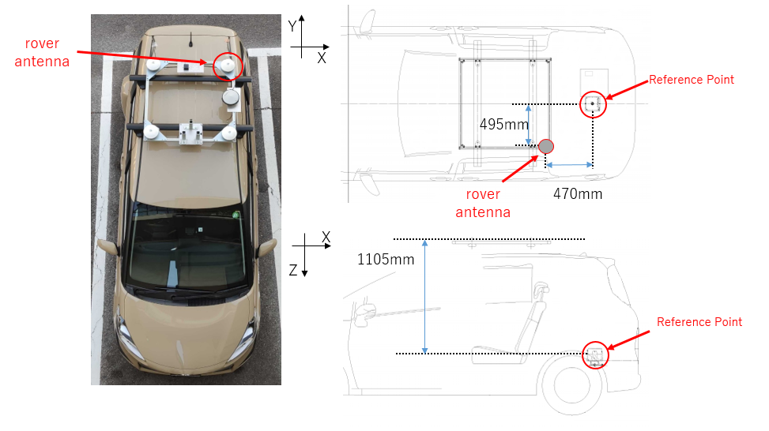
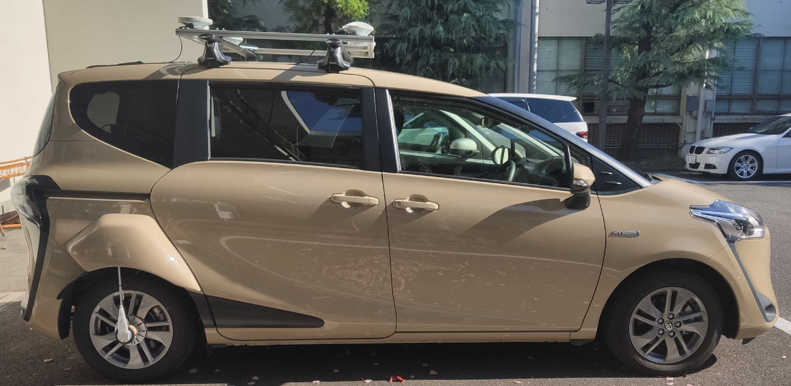
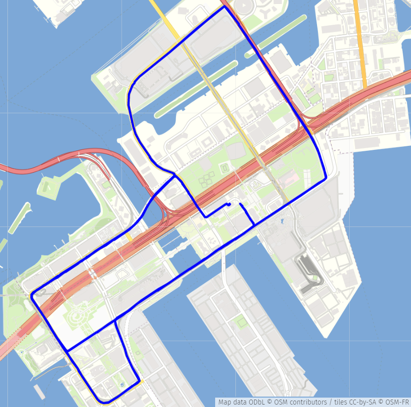
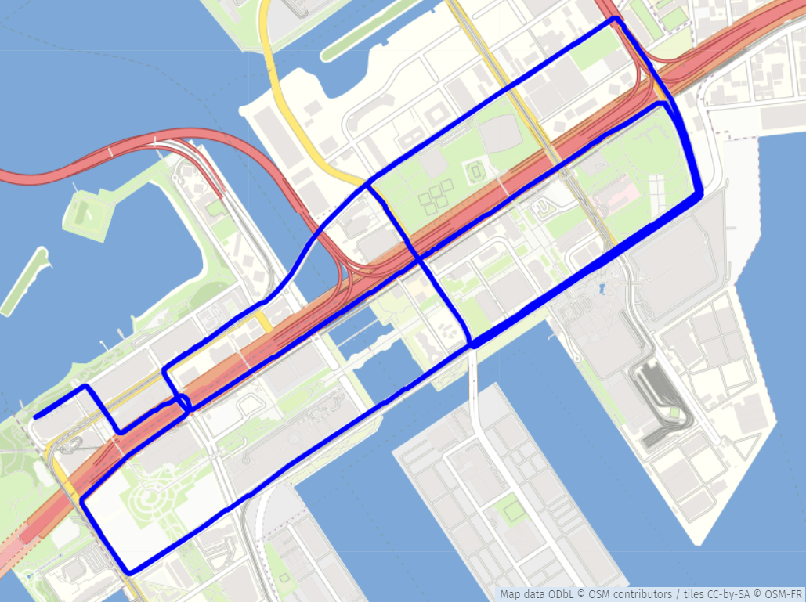

## 正式な記載内容は[英語版](https://github.com/MeijoMeguroLab/open_data/blob/main/docs/2020_dataset.md)を確認してください.

# 自律走行のためのGNSS/IMUオープンデータセット
 データセットのご利用をご希望の方は、[[こちら](https://forms.gle/w22wkHnyewGXhJN6A)]
 のフォームにご記入ください。担当者より配布先をご連絡させていただきます。
## システム/機材構成の説明

&emsp;東京でのデータ収集のためのプラットフォームはトヨタのシエンタ(Sienta)です。 
&emsp;このプラットフォームには以下のセンサーが搭載されています。 
  
- <b>IMU</b>
  - Model: ADIS16475-2
  - Data rate: 50 Hz
  - Gyro bias Repeatability: 0.7 deg/s
  - Gyro In-Run Bias Stability: 2.5 deg/hr

- <b>Multiple GNSS receivers</b>
  - Model: u-blox F9P
    - Data rate: 5 Hz.
    - GNSS: BeiDou, Galileo, GPS / QZSS
    - GNSS Bands: B2I, E1B/C, L2OF, L2C, B1I, E5b, L1OF, L1C/A
    - Oscillator: TCXO
  - Model: Septentrio Mosaic-x5
    - Data rate: 5 Hz.
    - GNSS: BeiDou, Galileo, GLONASS, GPS / QZSS
    - GNSS Bands: E1C, L1OF, L1C/A, B2I, E5a, L2OF, L2C, L5, E5b
  - Model: Trimble Alloy (Geodetic GNSS receiver)
    - Data rate: 5 Hz.
    - GNSS: BeiDou, Galileo, GLONASS, GPS / QZSS
    - GNSS Bands: L5, B2I, E1B/C, L2OF, L2C, B1I, E5b, L1OF, L1C/A
- <b>Rover GNSS Antenna</b>
  - Model: Trimble Zephyr 3 Rover
- <b>CLAS receiver</b>
  - Model: AQLOC-Light
    - GNSS: Galileo, GPS / QZSS
    - GNSS Bands: L6, L2C, E5b, L1C/A, E1
- <b>Applanix POS LV</b> (high-grade RTK GNSS/INS integrated navigation system)
  - Model: POS LV 220
  - Data rate: 10 Hz.
  - Accuracy (RMS)
    - X, Y position: 0.02 m
    - Z position: 0.05 m
    - Roll and Pitch angle: 0.015 degree
    - True heading: 0.025 degree

## データフォーマット

- <b>GNSS</b>

  <b>ファイル名:</b> 
  &emsp;移動局の観測ファイルは "rover_ublox.obs" "rover_mosaic.obs" と "rover_trimble.obs" になります. 
  &emsp;基準局の観測ファイルは "base_trimble.obs" になります. 
  &emsp;BaseStationの位置は、ECEF座標で -3961903.8578, 3348993.2385, 3698211.3503 になります. 
  
  <b>RINEX VERSION:</b>&emsp;RINEX 3.02 
  
  <b>取得周期:</b> 
  |  ファイル名  |  周期  |
  | ---- | ---- |
  |  rover_trimble.obs  |  5Hz  |
  |  rover_mosaic.obs  |  5Hz  |
  |  rover_ublox.obs  |  5Hz  |
  |  base_trimble.obs  |  1Hz  |
  
  <b>使用衛星:</b>&emsp;GPS, GLONASS, Galileo, BeiDou, QZSS 
  
  &emsp;&emsp;搬送波位相, 議事距離, ドップラー, SNR情報を含みます.(例外として、mosaic-x5はドップラーを含みません.) 
  
- <b>IMU</b>

  <b> ファイル名:</b>&emsp;imu.csv 
  <b>データ説明</b> 
  
  |  ヘッダー  |
  | ---- |
  |  GPS TOW(s)  |
  |  GPS Week  |
  |  Angular rate X(rad/s)  |
  |  Angular rate Y(rad/s)  |
  |  Angular rate Z(rad/s)  |
  |  Acceleration X(m/s^2)  |
  |  Acceleration Y(m/s^2)  |
  |  Acceleration Z(m/s^2)  |
  |  Wheel velocity  |

- <b>CLAS</b>

  <b>ファイル名:</b>&emsp;rover_clas.l6 
  <b>データ説明:</b> 
  &emsp;CLASデータは [AQLOC-light](https://www.mitsubishielectric.co.jp/esg/aqloc/products/light/)を使用して収集しました. 
  &emsp;データはCLASのパケットメッセージに格納されています。 
  
- <b>リファレンス</b>

  <b>ファイル名:</b>&emsp;reference.csv 
  <b>データ説明:</b> 
  &emsp;位置と姿勢の真値は、POSLV220でPOSPAc(後処理)を用いて収集しました. 
  
  |  ヘッダー  |
  | ---- |
  |  GPS TOW(s)  |
  |  GPS Week  |
  |  Latitude(deg)  |
  |  Longitude(deg)  |
  |  Ellipsoid Height(m)  |
  |  ECEF X(m)  |
  |  ECEF Y(m)  |
  |  ECEF Z(m)  |
  |  Roll(deg)  |
  |  Pitch(deg)  |
  |  Heading(deg)  |
  |  Velocity X (m/s)  |
  |  Velocity Y (m/s)  |
  |  Velocity Z (m/s)  |
  |  Acceleration X (m/s^2)  |
  |  Acceleration Y (m/s^2)  |
  |  Acceleration Z (m/s^2)  |
  |  Angular rate X (rad/s)  |
  |  Angular rate Y (rad/s)  |
  |  Angular rate Z (rad/s)  |

- <b>リファレンス(セミダイナミック補正済み)</b>

  <b>ファイル名:</b>&emsp;semi-dynamic_corrected_reference.csv 
  <b>データ説明:</b> 
  &emsp;位置と姿勢の真値は、POSLV220でPOSPAc(後処理)を用いて収集しました. 
  &emsp;位置と姿勢の真値は、セミダイナミック補正しています. 

## データセット説明

### 走行データ1
 <b>Date&emsp;2020/12/17</b> 
 
  |    |  GPS Week  |  GPS TOW(s)  |
  | ---- | ---- | ---- |
  |  Start  |  2136  |  360000  |
  |  End  |  2136  |  362400  |
 
 <b>環境:</b>&emsp;お台場 Sub-Urban environment [[map](https://www.google.co.jp/maps/@35.6275683,139.7754449,14.75z?hl=ja)] 
 
***
### 走行データ2 
 <b>Date&emsp;2020/12/17</b> 
 
  |    |  GPS Week  |  GPS TOW(s)  |
  | ---- | ---- | ---- |
  |  Start  |  2136  |  368100  |
  |  End  |  2136  |  370440  |
 
 <b>環境:</b>&emsp;お台場 Sub-Urban environment  [[map](https://www.google.co.jp/maps/@35.6275683,139.7754449,14.75z?hl=ja)] 
 
